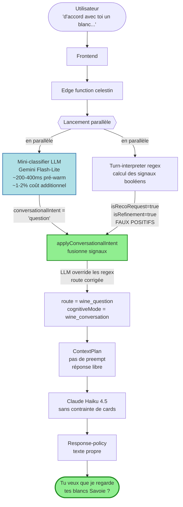

# Celestin — diagrammes de la chaîne de routing

> Pour voir les **schémas graphiques**, ouvre ce fichier dans VS Code (mode preview) ou GitHub. Le terminal n'affiche pas le Mermaid, donc une version ASCII suit en dessous de chaque diagramme.

---

## 1. Chaîne actuelle (cas du drift 2026-05-07)

### Mermaid (preview pour rendu graphique)

```mermaid
flowchart TD
    U([Utilisateur<br/>'d'accord avec toi un blanc...']) --> F[Frontend<br/>celestinChatRequest]
    F -->|body: message + history| E[Edge function<br/>celestin]
    E --> TI{Turn-interpreter<br/>regex pur}
    TI -->|"accord" → isRecoRequest=true<br/>"un blanc" → isRefinement=true| ROUTE[route =<br/>recommendation_request]
    ROUTE --> CP[ContextPlan<br/>cellarCandidates=preempted<br/>contrat: doit produire<br/>recommendation_selection]
    CP --> SR[SourceResolver<br/>preload 6 candidats cave]
    SR --> PA[PromptAssembler]
    PA --> LLM[Claude Haiku 4.5<br/>contrainte: selection obligatoire]
    LLM -->|texte conversationnel<br/>+ selection vide ou invalide| RP{Response-policy<br/>contrôle contrat}
    RP -->|contrat violé:<br/>'no resolvable selection'| FAIL[Fallback: tous providers<br/>Haiku→Gemini→GPT-4.1 mini<br/>échouent au même point]
    FAIL --> ERR([Désolé, je suis<br/>momentanément<br/>indisponible])

    style TI fill:#ffe4b5,stroke:#d2691e,stroke-width:2px
    style RP fill:#ffe4b5,stroke:#d2691e,stroke-width:2px
    style ERR fill:#ffb6c1,stroke:#dc143c,stroke-width:3px
```

### ASCII art (lisible en terminal)

```
   ┌────────────────────────────────┐
   │  USER: "d'accord avec toi      │
   │  un blanc..."                  │
   └──────────────┬─────────────────┘
                  │
                  ▼
   ┌────────────────────────────────┐
   │  Frontend (celestinChatRequest)│
   └──────────────┬─────────────────┘
                  │  body { message, history }
                  ▼
   ┌────────────────────────────────┐
   │  Edge function celestin        │
   └──────────────┬─────────────────┘
                  ▼
   ╔════════════════════════════════╗
   ║ Turn-interpreter (regex pur)   ║  ◄── point de fragilité 1
   ║ ──────────────────────────     ║
   ║ "accord"  → isRecoRequest=TRUE ║      (faux positif "d'accord")
   ║ "un blanc"→ isRefinement=TRUE  ║      (cumul piège)
   ║ ──────────────────────────     ║
   ║ route = recommendation_request ║
   ╚══════════════╤═════════════════╝
                  ▼
   ┌────────────────────────────────┐
   │  ContextPlan                   │
   │  cellarCandidates = preempted  │
   │  contrat: DOIT produire        │
   │           recommendation_      │
   │           selection            │
   └──────────────┬─────────────────┘
                  ▼
   ┌────────────────────────────────┐
   │  SourceResolver                │
   │  → preload 6 candidats cave    │
   └──────────────┬─────────────────┘
                  ▼
   ┌────────────────────────────────┐
   │  Prompt assembler              │
   └──────────────┬─────────────────┘
                  ▼
   ┌────────────────────────────────┐
   │  Claude Haiku 4.5              │
   │  (contrainte: selection        │
   │   obligatoire)                 │
   │                                │
   │  → texte conversationnel       │
   │  → mais selection invalide     │
   │     (la phrase n'est PAS       │
   │      une demande de reco)      │
   └──────────────┬─────────────────┘
                  ▼
   ╔════════════════════════════════╗
   ║ Response-policy: contrat       ║  ◄── point de fragilité 2
   ║ ──────────────────────────     ║      pas de mode dégradé,
   ║ "no resolvable                 ║      crie au feu au lieu
   ║  recommendation_selection"     ║      de se rabattre
   ║                                ║
   ║ → tous providers échouent      ║
   ║   (Haiku → Gemini → GPT-4.1)   ║
   ╚══════════════╤═════════════════╝
                  ▼
   ┌────────────────────────────────┐
   │ ❌ Fallback hardcodé:           │
   │   "Désolé, je suis             │
   │    momentanément               │
   │    indisponible"               │
   └────────────────────────────────┘
                  ▼
              USER VOIT
            l'erreur visible
```

**Les deux points de fragilité (encadrés doubles) :**

1. **Turn-interpreter** : regex sans nuance. Un mot piégeux (`accord` dans `d'accord`) cumulé avec un autre signal (`un blanc`) suffit à classer en `recommendation_request`.
2. **Response-policy** : binaire. Le contrat est violé → erreur globale. Aucun mode dégradé qui aurait laissé passer le texte conversationnel valide produit par Claude.

---

## 2. Option C — Hybride avec classifier LLM léger en parallèle

### Mermaid (preview pour rendu graphique)



### ASCII art (lisible en terminal)

```
   ┌────────────────────────────────┐
   │  USER: "d'accord avec toi      │
   │  un blanc..."                  │
   └──────────────┬─────────────────┘
                  │
                  ▼
   ┌────────────────────────────────┐
   │  Frontend                      │
   └──────────────┬─────────────────┘
                  ▼
   ┌────────────────────────────────┐
   │  Edge function celestin        │
   └──────────────┬─────────────────┘
                  │
        ╔═════════╧═════════╗
        ║   PARALLÈLE       ║
        ╚═══════╤═══════════╝
                │
       ┌────────┴────────┐
       ▼                 ▼
  ┌─────────────┐   ┌──────────────────────────┐
  │ Mini-       │   │  Turn-interpreter        │
  │ classifier  │   │  (regex)                 │
  │ LLM         │   │                          │
  │ Gemini      │   │  isRecoRequest = TRUE    │
  │ Flash-Lite  │   │  isRefinement  = TRUE    │
  │             │   │  (faux positifs comme    │
  │ ~200-400 ms │   │   avant — INCHANGÉ)      │
  │ +1-2% coût  │   │                          │
  │             │   │                          │
  │ → intent =  │   │                          │
  │  'question' │   │                          │
  └──────┬──────┘   └──────────┬───────────────┘
         │                     │
         └──────────┬──────────┘
                    ▼
   ╔════════════════════════════════╗
   ║ applyConversationalIntent()    ║  ◄── le hook EXISTE déjà
   ║ ──────────────────────────     ║      dans turn-signals.ts:233
   ║ Si intent LLM ≠ regex          ║      → on rebranche le
   ║ → LLM override les booléens    ║        producer manquant
   ║   regex                        ║
   ║                                ║
   ║ Résultat:                      ║
   ║ route = wine_question          ║
   ║ cognitiveMode =                ║
   ║   wine_conversation            ║
   ╚══════════════╤═════════════════╝
                  ▼
   ┌────────────────────────────────┐
   │  ContextPlan                   │
   │  PAS de preempt                │
   │  Réponse libre, pas de         │
   │  contrat strict de cards       │
   └──────────────┬─────────────────┘
                  ▼
   ┌────────────────────────────────┐
   │  Claude Haiku 4.5              │
   │  (sans contrainte selection)   │
   └──────────────┬─────────────────┘
                  ▼
   ┌────────────────────────────────┐
   │  Response-policy               │
   │  → texte conversationnel       │
   │     accepté tel quel           │
   └──────────────┬─────────────────┘
                  ▼
   ┌────────────────────────────────┐
   │ ✅ "Tu veux que je regarde      │
   │     tes blancs Savoie ?"       │
   └────────────────────────────────┘
                  ▼
              USER VOIT
          la bonne réponse
```

**Ce qui change :**

- **Pas de point de fragilité unique** : le routing décide en consommant 2 signaux (regex rapide + LLM nuancé). Ils se valident mutuellement.
- **Latence inchangée pour l'utilisateur** : le classifier tourne en parallèle, on attend juste le plus lent (souvent le main call Claude qui est de toute façon le chemin critique).
- **Coût marginal faible** : ~+1-2% par tour (Flash-Lite est ~13× moins cher que Haiku), pas un vrai doublement budgétaire.
- **Le hook existe déjà** : `applyConversationalIntent` dans `turn-signals.ts:233` est branché et inactif depuis le 3 mai. On rebranche un producer.

---

## 3. Comparaison côte à côte des points de décision

| Étape du pipeline | Aujourd'hui | Option C |
|---|---|---|
| Classification du tour | Regex seul, binaire | Regex + signal LLM, fusionnés |
| Décision "preempt cellar candidates ?" | Forcée par le route regex | Le LLM peut désamorcer le preempt si le regex se trompe |
| Réponse Claude | Sous contrat strict si preempt | Libre quand le routing le permet |
| Quand le contrat est violé | Erreur visible utilisateur | Devrait être rare (le routing est plus juste en amont) |

---

## 4. Les variantes de C qu'on peut considérer

| Variante | Quand le classifier tourne | Latence ajoutée | Coût ajouté | Complexité |
|---|---|---|---|---|
| **C-1 parallèle systématique** | Toujours, en parallèle | ~0 ms | +~1-2% par tour | Moyenne |
| **C-2 séquentiel systématique** | Toujours, avant le turn-interpreter | +200-500 ms par tour | +~1-2% par tour | Moyenne |
| **C-3 conditionnel** | Seulement si regex détecte ≥2 signaux contradictoires | +200-500 ms sur ~5-10% des tours | +~0.1% par tour | Plus haute (méta-règle d'ambiguïté) |

C-1 est probablement le bon point d'équilibre si on attaque C un jour : simple à implémenter, pas de latence, coût négligeable. C-3 est plus élégant mais demande une logique fine de détection d'ambiguïté.

---

## 5. Rappel option A pour comparaison

L'option A garde le turn-interpreter regex inchangé et ajoute la **dégradation gracieuse** dans la response-policy : quand le contrat est violé, on n'envoie plus le message d'erreur, on **strip le ui_action et les cards**, on garde le texte propre que Claude a produit, l'utilisateur ne voit aucun problème.

C'est un fix purement défensif côté étage 4, qui rend les drifts invisibles côté UX sans toucher à la racine. Bon premier pas si la fréquence des drifts est faible (< 1-2% en prod).
