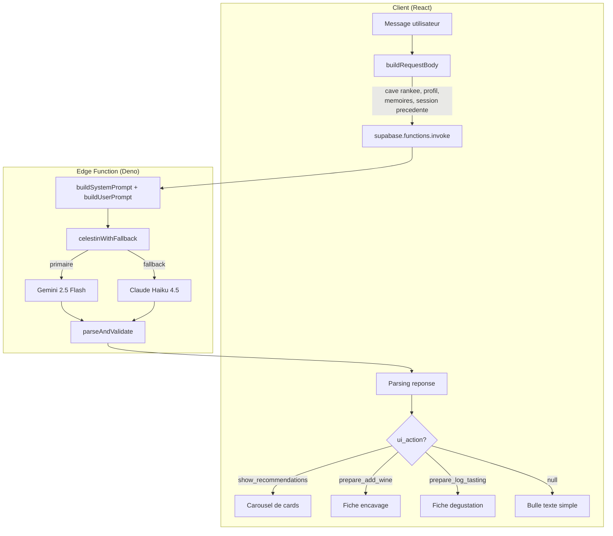
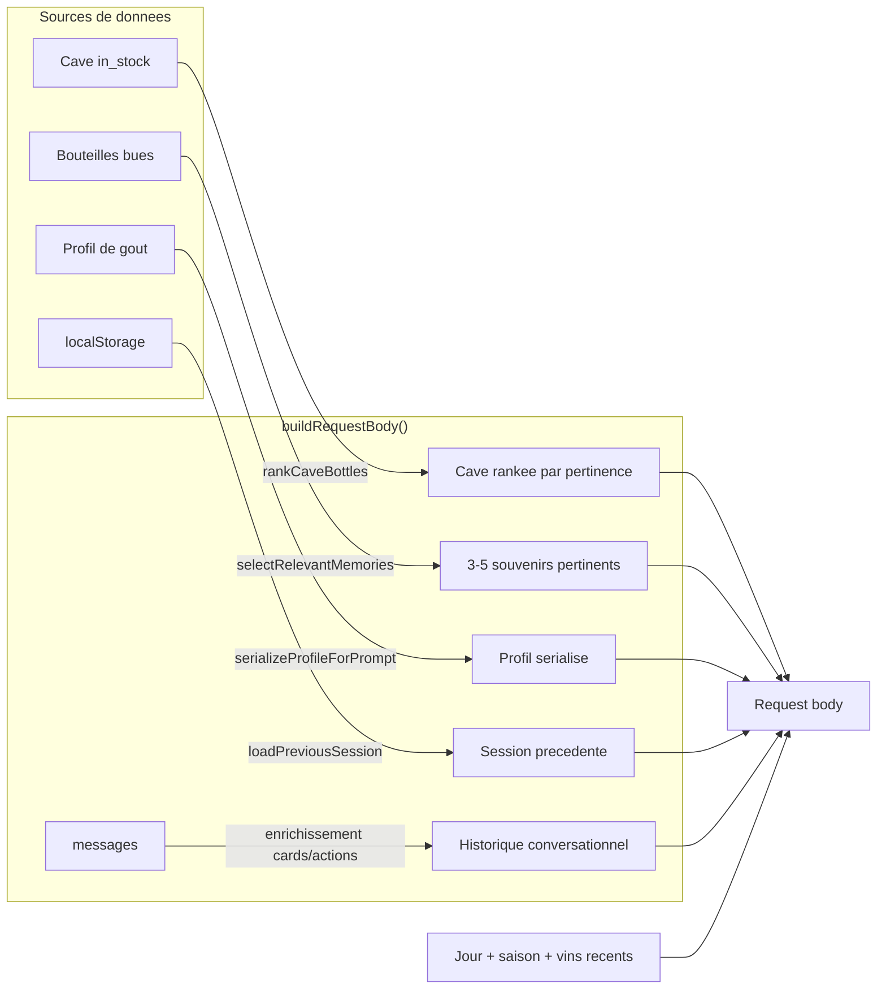
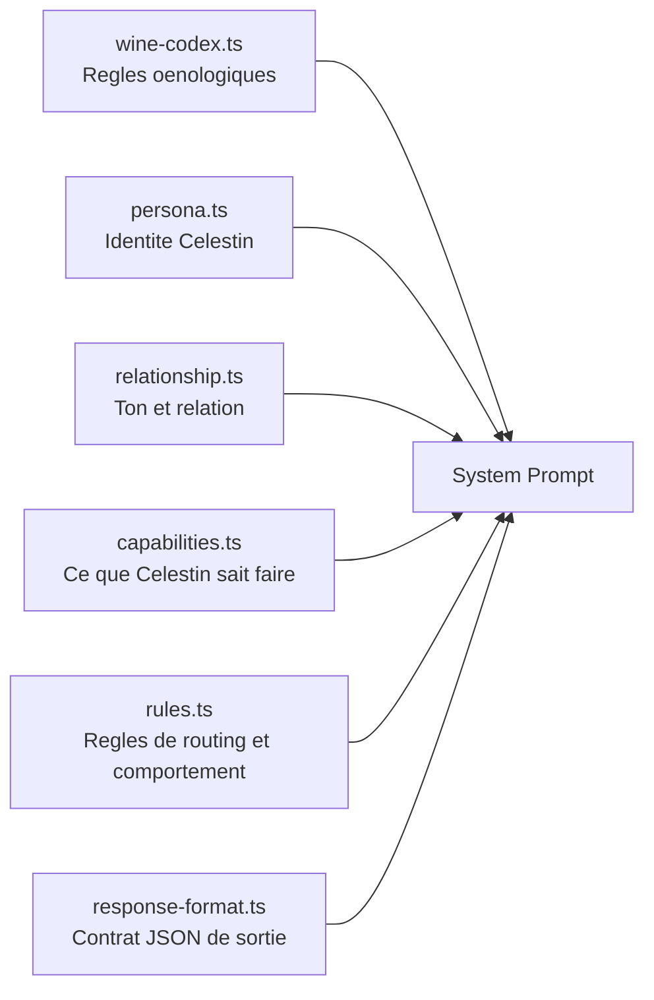
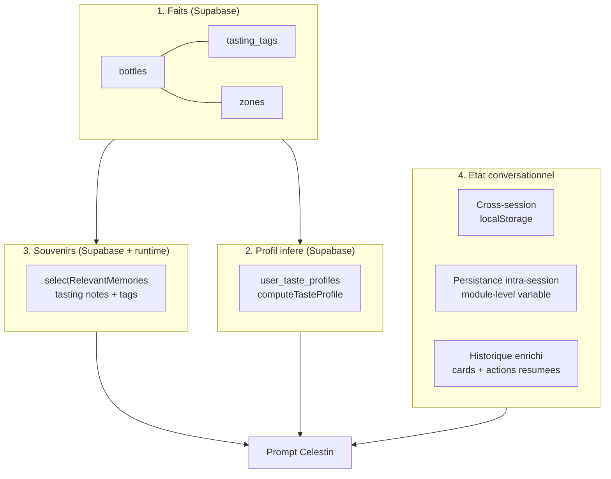

# Architecture Celestin

Celestin est le sommelier IA de l'app. Ce document decrit comment un message utilisateur est traite, du tap sur "Envoyer" jusqu'a la reponse affichee.

## Vue d'ensemble

## Pipeline de contexte

Quand l'utilisateur envoie un message, `buildRequestBody()` dans `CeSoirModule.tsx` assemble tout le contexte :

### Detail de chaque source

| Source | Fichier | Ce qui est envoye |
|--------|---------|-------------------|
| **Cave rankee** | `recommendationRanking.ts` | Toutes les bouteilles in_stock, triees par score local (couleur, profil, saison, maturite, exploration) |
| **Profil de gout** | `taste-profile.ts` | Stats agregees : appellations/domaines preferes, couleurs, prix, QPR, aromes, plats vecus, descripteurs, occasions |
| **Souvenirs** | `tastingMemories.ts` | 3-5 bouteilles bues avec notes, tags, rating — selectionnees par pertinence textuelle ou fallback proactif |
| **Session precedente** | `CeSoirModule.tsx` | Derniers 12 tours de la session precedente (localStorage, TTL 7 jours) |
| **Historique** | `CeSoirModule.tsx` | Messages de la conversation actuelle, enrichis avec resume des cards et fiches vin |
| **Contexte** | `contextHelpers.ts` | Jour de la semaine, saison, vins bus recemment (a eviter) |

## System prompt (edge function)

Le system prompt est assemble par `prompt-builder.ts` en concatenant 6 modules :

### Routing LLM

Le LLM decide lui-meme le type de reponse. Les regles dans `rules.ts` le guident :

| Situation | ui_action |
|-----------|-----------|
| Recommandation de vin | `show_recommendations` avec 3-5 cards |
| Utilisateur veut encaver | `prepare_add_wine` avec extraction structuree |
| Utilisateur veut noter une degustation | `prepare_log_tasting` avec extraction |
| Question, conversation, doute | `null` (texte seul) |

## Fichiers cles

### Client (`src/`)

| Fichier | Role |
|---------|------|
| `components/discover/CeSoirModule.tsx` | Composant principal : chat UI, assemblage du contexte, appel edge function, gestion des cards/fiches, memoire cross-session |
| `lib/taste-profile.ts` | Calcul du profil de gout (stats, tags agreges), serialisation pour le prompt |
| `lib/tastingMemories.ts` | Selection des souvenirs pertinents, serialisation pour le prompt |
| `lib/recommendationRanking.ts` | Scoring local des bouteilles en cave (couleur, saison, profil, maturite, exploration) |
| `lib/recommendationStore.ts` | Cache en memoire des reponses (TTL 10 min) |
| `lib/contextHelpers.ts` | Utilitaires : saison, jour, formatage, resolution des IDs courts |
| `lib/types.ts` | Types partages : `ComputedTasteProfile`, `TastingTags`, `TagFrequency`, etc. |
| `hooks/useTasteProfile.ts` | Hook React pour charger le profil depuis Supabase |

### Edge function (`supabase/functions/celestin/`)

| Fichier | Role |
|---------|------|
| `index.ts` | Handler HTTP : recoit le body, construit les prompts, appelle le LLM (Gemini puis Claude fallback), parse et valide la reponse |
| `prompt-builder.ts` | Assemble le system prompt depuis les 6 modules |
| `persona.ts` | Identite de Celestin (ami sommelier, pas snob, opinions franches) |
| `relationship.ts` | Ton de la relation (tutoiement, chaleur, naturel, usage des souvenirs et donnees vecues) |
| `capabilities.ts` | Ce que Celestin sait faire (recommander, encaver, noter, converser) |
| `rules.ts` | Regles de routing, comportement, accords mets-vins, extraction, enrichissement |
| `wine-codex.ts` | Connaissances oenologiques de reference (accords, temperatures, cepages adjacents) |
| `response-format.ts` | Contrat JSON de sortie (message + ui_action optionnel) |

## Memoire : 4 couches

### V1 — Etat actuel (mars 2026)

Voir `celestin-memory-plan.md` pour le plan complet et l'avancement.
