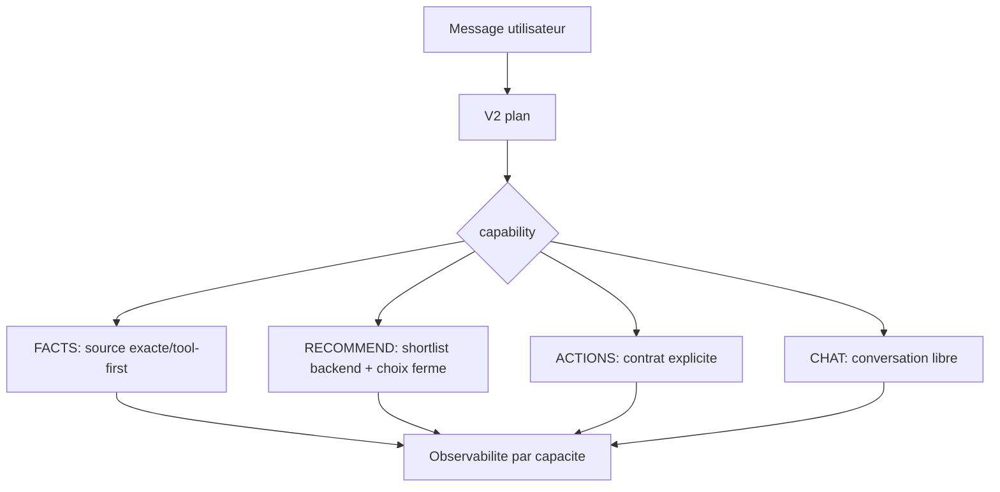

# Celestin V2 — direction, architecture et plan de developpement

> Statut : prototype mince en cours de validation.
> Derniere mise a jour : 2026-05-16.
> Commit de reference : `2bd720d` (`Add experimental Celestin V2 orchestration`).

## 1. Idee directrice

Celestin V2 ne repart pas de zero. L'objectif est de prouver, avant tout refactor lourd, qu'une orchestration plus stricte et plus mesurable peut battre la V1 sur les usages qui justifient vraiment le produit :

- repondre exactement sur la cave et les degustations ;
- recommander depuis la cave avec des cartes correctes ;
- declencher des actions applicatives sans ambiguite ;
- rester naturel en conversation vin libre.

La regle structurante est simple : **le LLM n'est plus la source de verite pour les faits personnels**. La cave, les degustations, les souvenirs structures et le profil compile restent les sources d'autorite. Le LLM sert a formuler, comparer, expliquer et choisir dans une liste fermee quand c'est utile.

V2 est donc un prototype derriere flag, pas un remplacement direct de V1. La V1 reste le comportement par defaut tant que la comparaison par capacite n'a pas prouve un gain clair.

## 2. Vision produit

Celestin doit etre juge sur la qualite de conversation utile, pas sur le nombre de chemins techniques. La V2 doit rendre les bons comportements plus probables parce que l'architecture les impose :

- sur une question factuelle, Celestin doit consulter ou utiliser une source exacte ;
- sur une recommandation, le backend construit les candidats et materialise les cartes ;
- sur une action, Celestin doit disposer d'un contrat explicite et d'une confiance suffisante ;
- sur une question generale, Celestin peut discuter librement sans forcer la cave.

La promesse produit n'est pas "un chatbot plus intelligent". C'est un sommelier personnel qui sait quand il parle depuis la cave, quand il parle depuis l'experience de degustation, quand il propose une action, et quand il fait simplement conversation.

## 3. Architecture V2 mince

La V2 ajoute une couche de planification interne avant l'orchestration existante. Cette couche classe chaque tour selon quatre capacites typées :

| Capacite | Role | Source d'autorite | Principe de reponse |
|---|---|---|---|
| `FACTS` | Questions exactes sur cave, degustations, quantites, notes | Backend, tools, donnees structurees | Source-first ; zero hallucination acceptee |
| `RECOMMEND` | Accords, choix de bouteille, refinements | Backend shortlist cave + profil | LLM choisit dans une liste fermee ; backend cree les cartes |
| `ACTIONS` | Encavage, degustation, sortie de stock, workflows | Contrat applicatif explicite | Pas d'action critique si confiance basse |
| `CHAT` | Culture vin, smalltalk, ambiguite non critique | Connaissance generale + contexte leger | Reponse libre, sans action forcee |

Chaque plan V2 expose les champs internes suivants :

- `capability` : capacite choisie pour le tour ;
- `confidence` : niveau de confiance du routage ;
- `requiredSources` : sources attendues avant de repondre ;
- `actionContract` : contrat applicatif explicite si une action est possible ;
- `responseMode` : mode de reponse attendu ;
- `orchestrationVersion` : `v1` ou `v2`.

Si la confiance est basse, V2 doit privilegier une clarification ou une reponse libre. Elle ne doit pas lancer un workflow couteux ou materialiser une action fragile.



## 4. Ce qui a ete implemente

Le prototype V2 actuel ajoute :

- un module `supabase/functions/celestin/v2-plan.ts` ;
- le champ `orchestrationVersion` dans les requetes Celestin ;
- les traces internes `capability`, `confidence`, `actionContract`, `responseMode` ;
- une migration d'observabilite avec vue admin par capacite ;
- l'affichage admin "Sante par capacite" ;
- des scripts d'eval et de scorecard capables de lancer `v1` ou `v2` ;
- un mode scorecard V2 authentifie sur le compte test, pour mesurer la vraie cave/profil/memoire Supabase plutot qu'une vieille fixture locale ;
- un comportement `RECOMMEND` ou le backend backfill les cartes seulement dans le cadre V2, sans changer le contrat V1 par defaut.

Le scorecard V2 est maintenant cable par defaut sur le compte test authentifie via :

```bash
npm run scorecard:celestin:v2
npm run scorecard:celestin:v2:quick
```

Ces scripts utilisent `--auth`, donc la fonction edge lit la cave, le profil et les souvenirs depuis Supabase sous le JWT du compte test. La fixture locale reste utile pour les scenarios, l'historique et le contexte de test, mais elle n'est plus la source de verite pour la cave en V2 scorecard.

## 5. Etat mesure au 2026-05-15

Run complet V2 authentifie :

- commande : `npm run scorecard:celestin:v2` ;
- rapport : `evals/results/scorecard-v2-2026-05-15T22-04-33-244Z.json` ;
- compte test : `213e0662-2a6a-4868-957b-bbab982b342f` ;
- score global : `98,8%` (`248/251`) ;
- `RECOMMEND` : `26` reponses, `0` echec, `26` cartes valides ;
- `FACTS` : `15` reponses, `0` echec ;
- `ACTIONS` : `4` reponses, `0` echec ;
- `CHAT` : `30` reponses, `3` echecs de concision (`max_5_lines`) ;
- validation repo : `npm run verify` vert.

Le point important : les echecs restants ne concernent pas le coeur V2 `FACTS` / `RECOMMEND`. Ils concernent des reponses `CHAT` trop longues.

## 5bis. Comparaison V1/V2 authentifiee au 2026-05-16

Un run V1 authentifie comparable a ete ajoute le 2026-05-16 :

- V1 : `evals/results/scorecard-2026-05-16T08-16-46-525Z.json` ;
- V2 : `evals/results/scorecard-v2-2026-05-15T22-04-33-244Z.json` ;
- analyse detaillee : `docs/celestin-v1-v2-auth-comparison-2026-05-16.md`.

Resume :

| Mesure | V1 auth | V2 auth | Lecture |
|---|---:|---:|---|
| Score global | 97,6% | 98,8% | Gain positif, pas suffisant seul |
| Echecs scores | 6 | 3 | V2 divise les echecs scores par 2 |
| RECOMMEND cartes valides | 14/16 | 26/26 | Gros signal V2 |
| FACTS | 0 echec | 0 echec | Egalite, V2 plus rapide |
| Latence p50 globale | 4147 ms | 3222 ms | V2 plus rapide |
| Tours non scores provider error | 1 | 3 | Point a surveiller cote V2 |

Nuance importante : V2 gagne fortement sur la presence de cartes valides, mais elle peut etre trop agressive. Certains tours affichent des cartes alors que le texte demande encore une precision. Avant une bascule, il faut verifier que V2 ne materialise pas des cartes quand `responseMode = clarification` ou quand la confiance est basse.

## 6. Criteres de succes V2

La V2 ne doit remplacer la V1 que si elle gagne sur les capacites qui comptent :

| Dimension | Cible V2 |
|---|---|
| Facts cave/degustations | >= 95% exacts, 0 hallucination de bouteille ou degustation |
| Recommandations | >= 90% des vraies demandes produisent des cartes correctes depuis la cave |
| Fallback provider | < 5% des tours normaux |
| Contrat casse | 0 erreur serveur sur les scenarios testes |
| Latence facts | < 500 ms quand la reponse peut etre deterministe |
| Latence reco | p50 < 4 s |
| Latence chat libre | p50 < 3 s |
| Cout facts exacts | zero LLM quand possible |
| Cout chat | pas plus qu'un appel LLM normal |

Ces seuils doivent etre lus par capacite, pas comme un score global unique. Un excellent score global peut masquer un mauvais comportement sur `RECOMMEND`, et inversement.

## 7. Plan de developpement

### Phase 1 — Diagnostic V1 mesure

Rejouer les memes scenarios sur V1 avec les scripts existants :

```bash
npm run scorecard:celestin
```

Sortie attendue : taux d'echec, latence, fallback, provider path, tool use, cout estime et exemples concrets, classes par capacite.

### Phase 2 — Comparaison V1/V2

Comparer V1 et V2 avec les memes conversations, le meme compte test, et les memes criteres. La comparaison doit rester par capacite :

- `FACTS` ;
- `RECOMMEND` ;
- `ACTIONS` ;
- `CHAT`.

V2 ne devient candidate au defaut que si elle gagne clairement sur facts, recommandations, erreurs serveur, fallback et cout/latence.

### Phase 3 — Durcir les points faibles

Priorites actuelles :

1. corriger ou mesurer le cas V2 "clarification + cartes" ;
2. analyser les fallback `RECOMMEND` restants dans le run V2 ;
3. reduire la verbosite `CHAT` sans ajouter de bequilles prompt inutiles ;
4. enrichir les scenarios multi-tour qui contaminent l'etat ;
5. ajouter des scenarios de recommandation personnelle (`Marc n'aime pas les tanins`, invites, souvenirs de diners) ;
6. documenter les decisions de bascule ou de stop.

### Phase 4 — Decision de bascule

Si V2 gagne sur `FACTS` et `RECOMMEND`, on peut envisager une bascule progressive :

1. activer V2 seulement pour admin/dogfood ;
2. observer par capacite ;
3. etendre a un petit pourcentage d'usage ;
4. basculer par defaut seulement apres absence de regression visible.

Si V2 ne gagne pas sur `FACTS` et `RECOMMEND`, on stoppe le refactor et on revoit l'hypothese.

## 8. Regles de prudence

- Ne pas supprimer V1 avant preuve comparative.
- Ne pas corriger les echecs par phrases prompt isolees si le probleme vient du routing, de l'etat, des sources ou du contrat runtime.
- Ne pas laisser le LLM inventer une bouteille, une degustation ou une note personnelle.
- Ne pas utiliser le fallback provider comme fonctionnement normal.
- Garder les diagnostics sensibles dans l'admin/debug.
- Preferer les scripts et l'observabilite aux impressions de dogfood non instrumentees.

## 9. Prochaine decision

La prochaine decision n'est pas "continuer le refactor" de maniere generale. Elle est plus precise :

> Est-ce que V2 bat V1, sur le meme compte test authentifie, par capacite, sans afficher de cartes quand elle est encore en train de clarifier ?

La prochaine etape logique est donc de traiter les ecarts reveles par la comparaison : cartes trop agressives, fallbacks `RECOMMEND`, verbosite `CHAT`, puis scenarios de recommandation personnelle.
